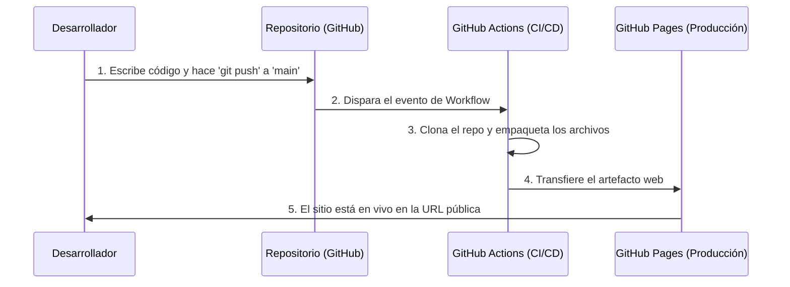

# Flujo CI/CD: Despliegue Automático en GitHub Pages

Este documento detalla de manera explícita cómo funciona el flujo de Integración Continua (CI) y Despliegue Continuo (CD) para el sitio web estático de Cristiano Ronaldo, conectando tu repositorio con GitHub Actions y GitHub Pages.

---

## 1. El Repositorio (GitHub Repository)
El repositorio (`https://github.com/eisefaaabri/ejemplo2`) actúa como la **única fuente de la verdad** (Single Source of Truth) para el código fuente del proyecto. 

- **Estructura:** Contiene todos los archivos del sitio (HTML, CSS, JS) en la carpeta `paginaCristianoRonaldo/`.
- **Eventos (Triggers):** Cada vez que realizas un `git push` a la rama principal (`main`), el repositorio dispara un evento interno. Este evento es el que le avisa a GitHub Actions que hay código nuevo que debe ser procesado.

---

## 2. Automatización (GitHub Actions)
GitHub Actions es el motor de automatización (el **Runner**) que se encarga de tomar tu código nuevo y prepararlo para producción sin intervención humana.

Para que funcione, se define un archivo YAML (por ejemplo, `.github/workflows/deploy.yml`) que le da instrucciones precisas a los servidores de GitHub:

### ¿Qué hace el Workflow paso a paso?
1. **Checkout:** Clona tu repositorio en una máquina virtual temporal (servidor de Ubuntu de GitHub).
2. **Configuración de Pages:** Prepara el entorno especificando que se trata de un despliegue hacia GitHub Pages.
3. **Subida de Artefactos (Upload Artifact):** Toma el contenido de la carpeta `paginaCristianoRonaldo/` y lo empaqueta. Ignora archivos de desarrollo (como este Markdown) y sube únicamente lo que el navegador necesita para renderizar el sitio.
4. **Despliegue (Deploy):** Envía este paquete directamente a la infraestructura de GitHub Pages.

> [!TIP]
> **Ejemplo de un archivo de Workflow (`deploy.yml`) para este proyecto:**
> ```yaml
> name: Desplegar en GitHub Pages
> 
> on:
>   push:
>     branches: ["main"]
> 
> permissions:
>   contents: read
>   pages: write
>   id-token: write
> 
> jobs:
>   deploy:
>     environment:
>       name: github-pages
>       url: ${{ steps.deployment.outputs.page_url }}
>     runs-on: ubuntu-latest
>     steps:
>       - name: Checkout del código
>         uses: actions/checkout@v4
>       - name: Configurar Pages
>         uses: actions/configure-pages@v4
>       - name: Subir artefacto
>         uses: actions/upload-pages-artifact@v3
>         with:
>           path: './paginaCristianoRonaldo' # Carpeta que contiene el index.html
>       - name: Desplegar en GitHub Pages
>         id: deployment
>         uses: actions/deploy-pages@v4
> ```

---

## 3. Alojamiento y Producción (GitHub Pages)
GitHub Pages es el **entorno de producción**. Es un servicio de alojamiento web estático gratuito y global (CDN) proporcionado por GitHub.

- **Recepción del código:** Una vez que GitHub Actions termina su trabajo de empaquetado, le entrega los archivos a GitHub Pages.
- **Distribución:** Pages toma tu `index.html`, `styles.css` y `script.js` y los distribuye a través de su red global de servidores.
- **URL Pública:** Tu sitio web queda disponible en vivo de forma instantánea bajo una URL pública como:
  `https://eisefaaabri.github.io/ejemplo2/`

### Configuración requerida en el Repositorio
Para que GitHub Actions tenga permiso de publicar en GitHub Pages, en la configuración de tu repositorio debes asegurar lo siguiente:
1. Ir a **Settings** > **Pages**.
2. En la sección **Source**, cambiar el origen de despliegue de "Deploy from a branch" a **"GitHub Actions"**.

---

## Resumen del Ciclo de Vida (El Flujo Completo)



Con este flujo, tu única preocupación como desarrollador es programar y hacer `git push`. **El proceso de construir, mover archivos y actualizar el servidor se vuelve 100% automático e invisible.**
